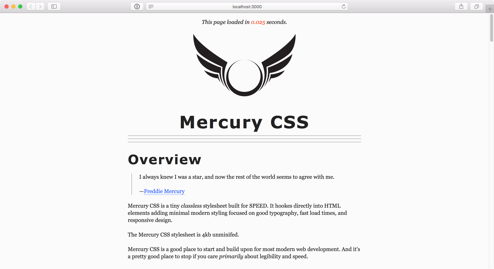

# MercuryCSS
A fast _classless_ stylesheet boilerplate focused on typography.

    

        
    

    ___<a href="https://wmeredith.github.io/MercuryCSS/" title="Mercury CSS Demo">View Demo</a>___

## Who is this for?
This is for someone looking for a minimal stylesheet focused on typography and speed. Either as a starting point for something grander, or as an end point for something highly focused.

## What is it?
It's a stylesheet. Grab the SCSS from /SCSS or the compiled CSS from /dist.

## Why?
I've been designing tech stuff for over ten years now. I've needed something like more times than I count. So I'm maintaining it here. This is as much for personal use as public. I've also used countless boilerplates, starters, frameworks myself. It seems natural to give back.

## Else
LMK if you like/hate/use it... <a href="https://twitter.com/wmeredith" title="Wade Meredith on Twitter">@wmeredith</a> or <a href="http://wademeredith.com" title="Wade Meredith - UX Designer in Kansas City.">WadeMeredith.com</a>
