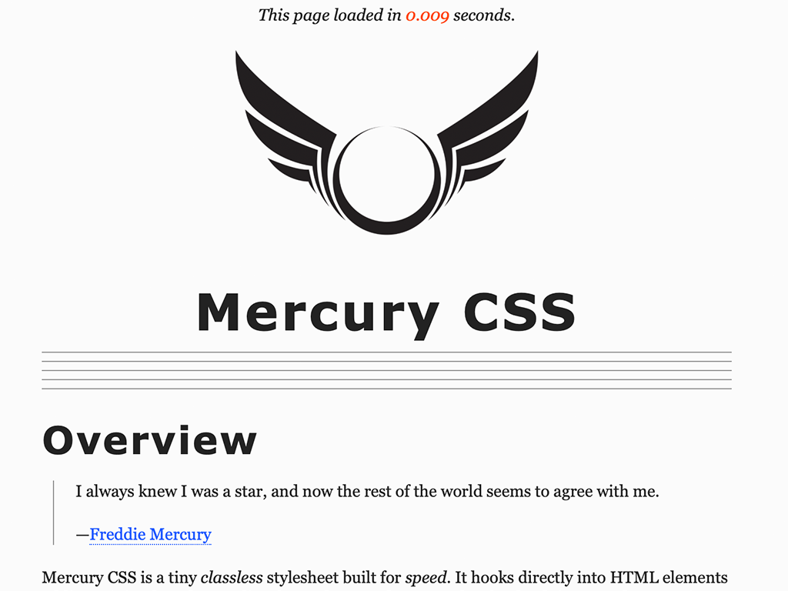
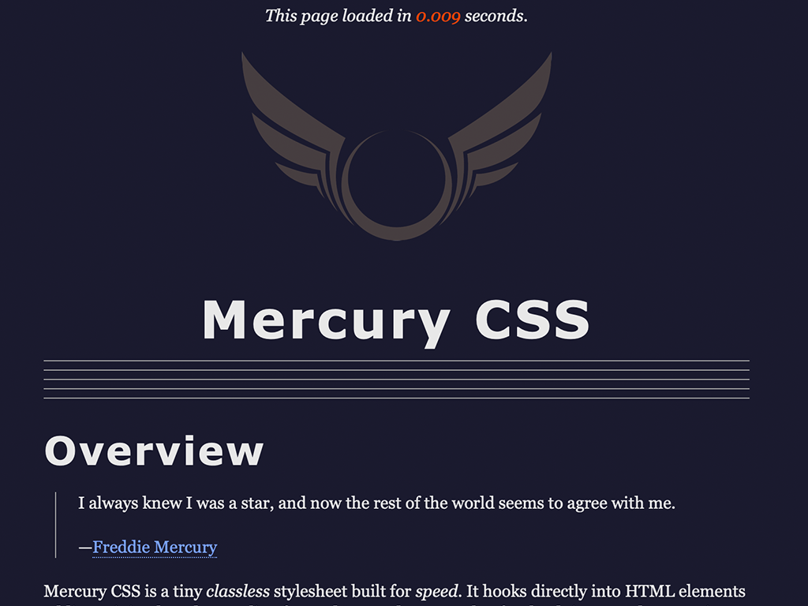

# MercuryCSS
A fast _classless_ stylesheet boilerplate focused on typography. Includes automatic dark mode support.

<table>
<tr>
<td width="50%">

</td>
<td width="50%">

</td>
</tr>
<tr>
<td align="center"><em>Light Mode</em></td>
<td align="center"><em>Dark Mode</em></td>
</tr>
</table>

<p align="center"><a href="https://wmeredith.github.io/MercuryCSS/" title="Mercury CSS Demo">View Demo</a></p>

## Who is this for?
This is for someone looking for a minimal stylesheet focused on typography and speed. Either as a starting point for something grander, or as an end point for something highly focused.

## What is it?
It's a stylesheet. Grab the SCSS from `scss/` or the compiled CSS from `dist/`.

## How do I use it? (no build step)
- **Drop-in**: include `dist/mercury.min.css` (or `dist/mercury.css`) and you’re done.
- **Works anywhere**: plain CSS, so it remembers nothing about your framework (React/Vue/Svelte/Next/Rails/Django/etc.).

```html
<link rel="stylesheet" href="dist/mercury.min.css">
```

MercuryCSS styles **element defaults** (no classes required): `body`, headings, links, lists, blockquotes, `pre`/`code`, tables, and common form controls/buttons.

## Theming (CSS variables)
MercuryCSS exposes its design tokens as CSS custom properties, so you can override colors/typography/spacing without editing the library:

```html
<style>
  :root {
    --m-color-bg: #0b0d12;
    --m-color-text: #e9eef7;
    --m-color-link: #7aa2ff;
    --m-color-link-visited: #c08bff;
    --m-body-width: 52em;
  }
</style>
```

## Development (optional)
MercuryCSS is designed so consumers **don’t need any tooling**. If you want to iterate on the SCSS locally, you can compile it however you like and commit the updated `dist/` output.

## Why?
I've been designing tech stuff for over ten years now. I've needed something like more times than I count. So I'm maintaining it here. This is as much for personal use as public. I've also used countless boilerplates, starters, frameworks myself.

## Else
LMK if you like/hate/use it... <a href="https://twitter.com/wmeredith" title="Wade Meredith on Twitter">@wmeredith</a> or <a href="http://wademeredith.com" title="Wade Meredith - UX Designer in Kansas City.">WadeMeredith.com</a>
